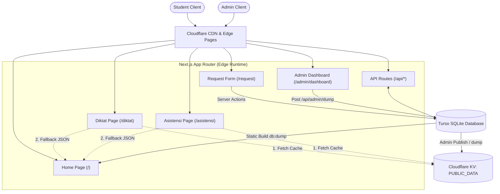
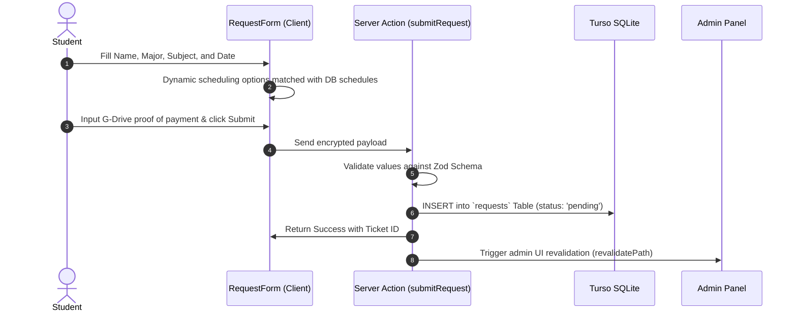
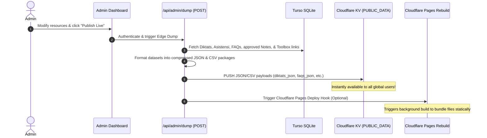
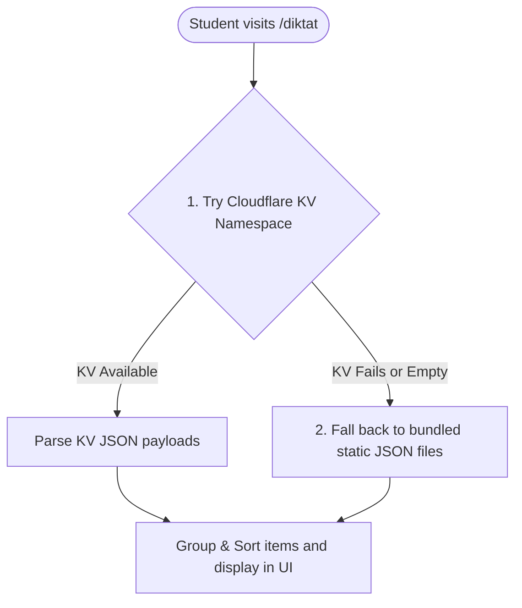

# AKPRO Web Application Architecture

This document provides a comprehensive technical overview of the architecture, data flows, database schemas, and caching strategies of the remastered **AKPRO Student Resources & Assistant Tutoring Reservation Platform**.

---

## 1. System Overview

The AKPRO platform is a high-performance, edge-optimized **Next.js 16** application designed specifically for deployment on **Cloudflare Pages**. It provides two core functionalities:
1. **Academic Resources Repository**: Students can download exam study books (Diktat), review assistant tutoring files/Zoom recordings (Asistensi), and browse student-submitted notes or helpful academic toolboxes.
2. **Tutoring & Assistant Reservation (Aktor)**: Students can book private tutoring sessions with teaching assistants (Pengasis) by submitting a multi-step request form with automated schedule matching and payment proof upload.

To ensure sub-100ms load times globally while offering real-time admin updates, the application implements a hybrid **Static Site Generation (SSG) + Cloudflare Edge Key-Value (KV) Cache + Turso SQLite Database** architecture.



---

## 2. Architectural Layers

### 2.1. Frontend Presentation Layer
- **Core Stack**: Next.js 16 (App Router), React 19, and Tailwind CSS v4.
- **State & Theme Management**: 
  - `ThemeContext.tsx` handles dark/light mode toggle smoothly with zero layout shift.
  - Interactive multi-step form state management inside client components like `RequestForm.tsx`.
- **Performance Optimization**: 
  - **Zero-Fetch Home Page**: The home page loads instantly with zero initial API calls.
  - **Lazy Page Data Fetching**: Resource listings (Diktat, Asistensi) are routed on separate pages (`/diktat`, `/asistensi`) so heavy data payloads are fetched only when requested.
  - **Dynamic Filters**: Client-side filtering (`FilterSelector.tsx`) allows instant grouping by Academic Year, Major (Elektro, Komputer, Biomedik), and Exam Period (UTS/UAS) without triggering server round-trips.

### 2.2. Backend & API Layer
- **Edge Runtime**: API routes are configured to run on the Edge Runtime (`export const runtime = 'edge'`) for near-zero startup latency.
- **Server Actions**: Multi-step request submissions are processed using Next.js Server Actions (e.g., `submitRequest` in `request.ts`), which provide built-in CSRF protection and streamlined form handling.
- **Validation**: Strict input parsing and validation are enforced using **Zod** both on the client and server side.
- **Session Security**: Admin dashboard paths (`/admin/dashboard` and `/admin/requests`) are protected at the routing level using standard Next.js `middleware.ts`. It parses and validates JWT tokens stored inside the `admin_token` cookie.

### 2.3. Data Storage & Cache Pipeline
The application uses two distinct data engines to balance real-time interactive writes with blazing-fast reads:

1. **Turso SQLite**: A highly available distributed SQLite database running on the edge. Used for holding reservation queues, assistant directories, notes, and academic content lists.
2. **Cloudflare KV Namespace (`PUBLIC_DATA`)**: Serves as the high-speed caching engine. The admin "Publish" dashboard compiles the entire relational database into consolidated JSON blocks and pushes them directly to Cloudflare KV. 

---

## 3. Data Synchronization Flows

To understand how the hybrid storage operates, let's explore three critical operational flows:

### 3.1. Tutoring Request Submission Flow


### 3.2. Administrative Publish & Caching Flow (Edge Update)
To prevent constant, expensive SQL reads on every student view, the app updates an edge cache when changes are made.


### 3.3. Runtime Resource Retrieval Flow (Smart Fetcher)
When a student visits a resource page like `/diktat`, the application uses a smart tiered fetcher (`dataFetcher.ts`):


---

## 4. Database Schema Structure

The database utilizes standard SQLite relational tables. Drizzle ORM manages the core transactional tutoring reservation schemas, while administrative items are retrieved using optimized SQL queries.

### 4.1. Core Tutoring & Reservation Schemas (Drizzle ORM)

#### A. Table: `pengasis`
Stores the active teaching assistants assigned to tutoring sessions.
```typescript
export const pengasis = sqliteTable("pengasis", {
  id: integer("id").primaryKey({ autoIncrement: true }),
  nama: text("nama").notNull(),
  kode: text("kode").notNull().unique(), // e.g. "AL", "GG", "VR"
  semester: integer("semester").notNull(), // 2 or 4
  matkul: text("matkul").notNull(), // JSON array: ["Dasar Sistem Digital", "Rangkaian Listrik 1"]
  aktif: integer("aktif", { mode: "boolean" }).notNull().default(true),
  createdAt: text("created_at").notNull().default(sql`(datetime('now'))`),
});
```

#### B. Table: `jadwal_asis`
Keeps track of weekly available tutoring slots per major/course.
```typescript
export const jadwalAsis = sqliteTable("jadwal_asis", {
  id: integer("id").primaryKey({ autoIncrement: true }),
  hari: text("hari").notNull(), // "Senin", "Selasa", etc.
  jamMulai: text("jam_mulai").notNull(), // e.g. "17:00"
  jamSelesai: text("jam_selesai").notNull(), // e.g. "23:00"
  matkul: text("matkul").notNull(),
  semester: integer("semester").notNull(),
  jurusan: text("jurusan"), // null = open to all majors; "Biomedik" | "Elektro" | "Tekkom"
});
```

#### C. Table: `requests`
Acts as the central transaction log for student tutoring bookings.
```typescript
export const requests = sqliteTable("requests", {
  id: integer("id").primaryKey({ autoIncrement: true }),
  namaLengkap: text("nama_lengkap").notNull(),
  angkatan: integer("angkatan").notNull(),
  jurusan: text("jurusan").notNull(),
  matkul: text("matkul").notNull(),
  tanggal: text("tanggal").notNull(), // ISO Date: YYYY-MM-DD
  jam: text("jam").notNull(), // e.g. "17:00"
  sudahHubungiJoy: integer("sudah_hubungi_joy", { mode: "boolean" }).notNull().default(false),
  sudahBayar: integer("sudah_bayar", { mode: "boolean" }).notNull().default(false),
  buktiBayarUrl: text("bukti_bayar_url"), // Link to Google Drive
  pengasisId: integer("pengasis_id").references(() => pengasis.id), // Assigned Assistant
  status: text("status").notNull().default("pending"), // "pending" | "verified" | "assigned" | "done" | "cancelled"
  catatan: text("catatan"),
  createdAt: text("created_at").notNull().default(sql`(datetime('now'))`),
  updatedAt: text("updated_at").notNull().default(sql`(datetime('now'))`),
});
```

---

### 4.2. Content Schemas (Admin & Resources)

#### D. Tables: `diktats` and `diktat_items`
Contains textbook resources mapped to targets.
- **`diktats`**: `id` (text, PK), `year` (int), `uts_uas` (text), `ganjil_genap` (text), `is_active` (bool).
- **`diktat_items`**: `id` (int, PK), `diktat_id` (FK -> diktats), `name` (text), `major` (JSON array of strings), `year` (JSON array of numbers), `google_drive_link` (text), `img` (text, nullable).

#### E. Tables: `asistensis` and `asistensi_items`
Contains recording links, session dates, and tutoring materials.
- **`asistensis`**: `id` (text, PK), `year` (int), `uts_uas` (text), `ganjil_genap` (text).
- **`asistensi_items`**: `id` (int, PK), `asistensi_id` (FK -> asistensis), `name` (text), `major` (JSON array of strings), `year` (JSON array of numbers), `person` (JSON array of tutor objects), `date` (text), `zoom_meetings_link` (text), `recordings_link` (text), `img` (text, nullable).

#### F. Table: `faqs`
Contains dynamic FAQs displayed on the home page dashboard.
- Fields: `id` (int, PK), `q` (text), `a` (text), `order_index` (int).

#### G. Table: `notes`
Enables crowd-sourced student summaries with photo uploads.
- Fields: `id` (int, PK), `title` (text), `subject` (text), `author_name` (text), `image_data` (BLOB, binary image), `status` (text: 'pending' | 'approved' | 'rejected'), `created_at` (text).

#### H. Tables: `toolbox_categories` and `toolbox_items`
Stores lists of external academic links.
- **`toolbox_categories`**: `id` (int, PK), `label` (text), `is_grouped` (bool), `order_index` (int).
- **`toolbox_items`**: `id` (int, PK), `category_id` (FK), `title` (text), `description` (text), `href` (text), `icon` (text), `group_name` (text), `order_index` (int).

---

## 5. Security & Availability Controls

1. **Edge HTTPS Enforcement**: The DB client (`db-client.ts`) automatically intercepts database connections starting with `libsql://` and upgrades them to secure HTTPS calls for seamless compatibility inside Cloudflare's Edge isolates.
2. **Multi-layer Validation**: All user inputs (especially GoDrive link validations and checkbox approvals) are strictly filtered via Zod to prevent any SQL injection or parameter corruption.
3. **Session Verification**: Next.js Middleware acts as a gatekeeper, verifying JWT signatures utilizing native crypto primitives in standard web execution environments.
4. **Fallback Resilience**: In the event that Turso, Cloudflare, or local internet connections fail, the application gracefully degrades by reading pre-built local JSON databases, ensuring 100% platform availability even when external microservices are unreachable.
